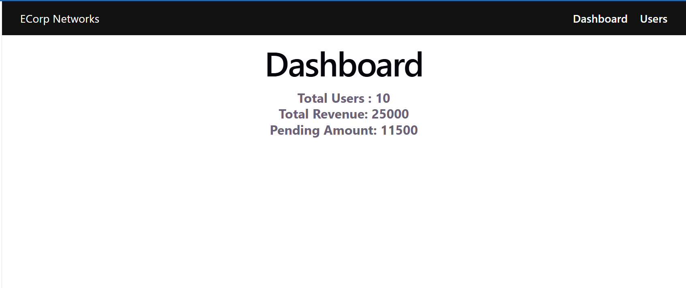
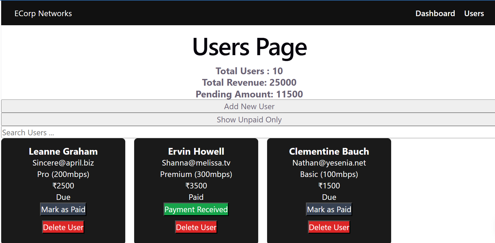
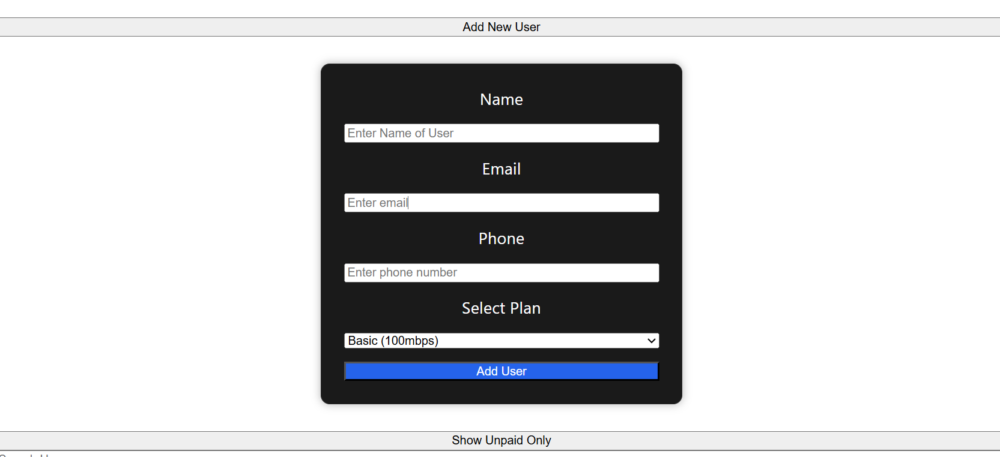

- 🔗 [Live App](https://e-corp-network.vercel.app/)
- 💻 [GitHub Repo](https://github.com/userManny/ECorp-Network)


## 🌐 ECorp Network

- A React-based ISP management dashboard designed to manage customers, subscription plans, billing, and payment status. The application features a centralized admin dashboard with dynamically updated statistics, dynamic user management, API integration, and complete frontend CRUD operations. It demonstrates scalable React architecture using component-based design, lifted state management, controlled forms, and dynamic UI rendering.
---

## 📸 Preview

### Dashboard


### Users Page


### ADD New User Form



## 🚀 Features

### 🧭 Navigation & Routing
- Built using **React Router**
- Pages:
  - `/dashboard` → Dashboard view
  - `/users` → Users management page
- Default route redirects to dashboard

---

### 👥 Users Management
- Display users in responsive card layout
- Search users dynamically by name
- Filter unpaid users
- Mark users as **Paid**
- Add new users using controlled forms
- Delete users with confirmation popup
- Dynamic plan-based billing generation
- Real-time UI updates using React state
---

### 📊 Dashboard
- Shows:
  - Total Users
  - Total Revenue
  - Pending Amount
- Updates automatically when user data changes

---

### 🔄 CRUD Operations
Implemented complete frontend CRUD functionality:

- **Create** → Add new users dynamically
- **Read** → Display and search user data
- **Update** → Update payment status
- **Delete** → Remove users with confirmation dialog

---

### 🔄 State Management (Important)
- **State Lifting implemented**
- `users` state is managed in `App.jsx`
- Shared across:
  - Users page (read + update)
  - Dashboard (read only)

---

### 🌐 API Integration
- Fetch users from API
- Transform API data into app-specific structure
- Fallback to dummy data if API fails

---

## 🧠 Key Concepts Used

### 🔹 React Concepts
- Functional Components
- Props & State
- useState, useEffect
- Conditional Rendering
- Component Reusability

---

### 🔹 Advanced Concepts
- State Lifting (Single Source of Truth)
- Data Transformation
- Controlled Inputs & Forms
- CRUD State Management
- Conditional Rendering
- Dynamic Form Handling
- Derived State (Dashboard stats)

---

### 🔹 Routing
- React Router v6
- `<Routes>` and `<Route>`
- Navigation using `<Link>`
- Default route handling

---

## 🏗️ Project Structure

```
src/
│
├── Components/
│   ├── Navbar/
│   ├── UserCard/
│   ├── DashboardStats/
│   └── AddUserForm/
│
├── pages/
│   ├── Users/
│   └── Dashboard/
│
├── data/
│   └── dummyUsers.js
│
├── App.jsx
└── main.jsx
```


---

## 🔄 Data Flow

App.jsx (state owner)  
↓  
Users.jsx (update state)  
↓  
Dashboard.jsx (read state)  

---

## 🛠️ Tech Stack

- React.js
- React Router DOM
- JavaScript (ES6+)
- CSS3
- REST API Integration
- Vite

---

## 🚀 Deployment

The application is deployed on **Vercel**.


---


## ⚙️ Installation

```bash
git clone https://github.com/userManny/ECorp-Network.git
cd ecorp-network
npm install
npm run dev

```

## 📌 How It Works

- App loads → API fetch runs  
- Users state stored in `App.jsx`  
- Data passed to **Users** and **Dashboard**  
- CRUD operations update shared application state
- Dashboard statistics update automatically in real-time
- User creation and deletion instantly re-render the UI  

---

## ⚠️ Important Learnings

- React does **NOT** share state automatically  
- Re-render happens when:
  - State changes  
  - Props change  
  - Parent re-renders  
- Route change causes **mount/unmount**  

---

## 🔥 Future Improvements
 
- Local Storage persistence
- Full Edit User functionality
- Authentication & Authorization
- Backend integration (Node.js / Express / MongoDB)
- Data visualization charts
- Responsive mobile-first design
- Global state management (Context API / Redux)
- Role-based admin dashboard 

---

## 🧑‍💻 Author

**Maneesh Kumar**