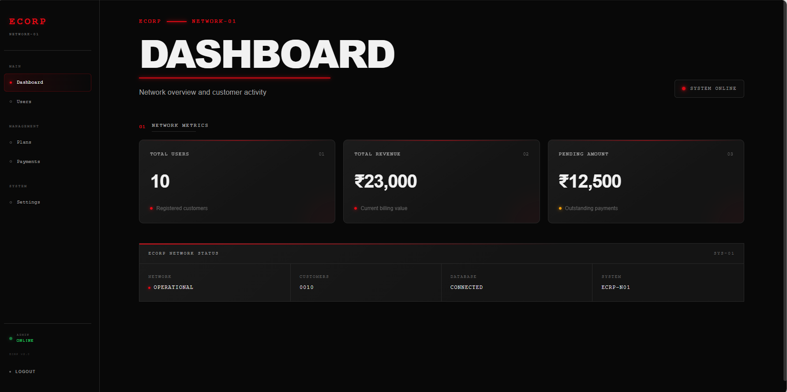
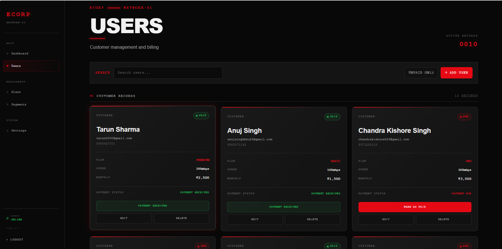
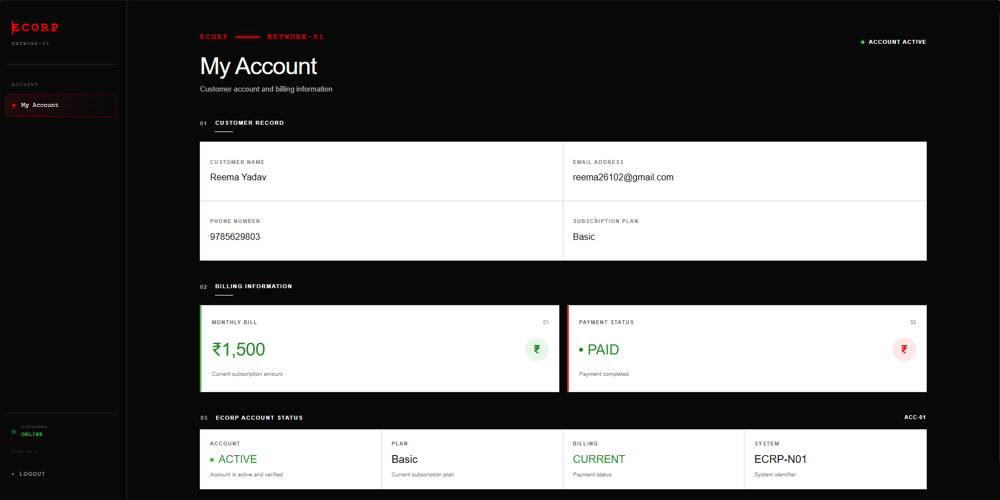
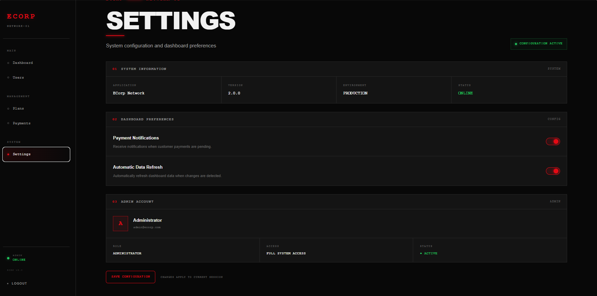

<!-- CNRL + Shift+ V                for preview in vs code -->

# 🌐 ECorp Network

> Full-stack ISP customer and billing management system built with React, Node.js, Express.js, MongoDB, and JWT authentication.

- 🔗 [Live App](https://e-corp-network.vercel.app/)
- 🔗 [Backend API](https://ecorp-network-1.onrender.com/api)
- 💻 [GitHub Repo](https://github.com/userManny/ECorp-Network)


## 🔑 Demo Credentials

Use the following credentials to explore the deployed application:

### 👑 Admin Account
- **Email:** `admin@ecorp.com`
- **Password:** `admin123`

### 👤 Customer Account
- **Email:** `arvind1997@gmail.com`
- **Password:** `user123`

> **Note:** These are demo accounts provided for testing the deployed application.

---
---


---
---

## 📸 Preview

### 📊 Admin Dashboard



### 👥 Customer Management




### 👤 Customer My Account



### ⚙️ Admin Settings



---

## 📌 Overview

**ECorp Network** is a full-stack ISP management application designed to manage customers, subscription plans, billing, payments, and account information through a centralized dashboard.

The application includes separate experiences for **Administrators** and **Customers**, with authentication and role-based authorization controlling access to different parts of the system.

The project started as a React-based dashboard and was expanded into a complete full-stack application with a Node.js/Express backend, MongoDB database, JWT authentication, protected routes, and persistent CRUD operations.

---

## ✨ Highlights

- 🔐 JWT-based authentication
- 👤 Admin and Customer roles
- 🛡️ Protected frontend and backend routes
- 👥 Customer management
- 💳 Billing and payment tracking
- 📊 Dynamic dashboard statistics
- 🗄️ MongoDB Atlas database
- 🔄 Complete CRUD operations
- 🔑 Password hashing with bcrypt
- 📱 Customer My Account page
- ⚙️ Admin settings and preferences
- 🔎 Customer search and filtering
- ⚡ React lazy loading and route-based code splitting
- 🌐 REST API architecture
- 💾 Persistent data stored in MongoDB

---

# 🚀 Features

## 🔐 Authentication & Authorization

The application uses JWT-based authentication for secure login.

### Authentication Features

- Admin login
- Customer login
- JWT token generation
- Password hashing using bcrypt
- Token-based API authentication
- Protected frontend routes
- Protected backend routes
- Logout functionality
- Persistent login using browser storage

### Role-Based Access

#### 👨‍💼 Administrator

Administrators can:

- View the dashboard
- View customer records
- Add customers
- Edit customer information
- Delete customers
- Mark customer payments as paid
- View billing statistics
- Access system settings

#### 👤 Customer

Customers can:

- Log in securely
- Access their own account
- View their personal information
- View their subscription plan
- View their monthly bill
- View payment status

Customers do not have access to administrator customer-management functionality.

---

# 📊 Dashboard

The administrator dashboard provides an overview of the current customer and billing data.

### Dashboard Statistics

- **Total Users**
- **Total Revenue**
- **Pending Amount**

The statistics are calculated from customer records and exclude administrator accounts.

Example:

```text
TOTAL USERS
2

TOTAL REVENUE
₹1,998

PENDING AMOUNT
₹999

Dashboard values update when customer records or payment status changes.
```
---

# 👥 Customer Management

Administrators can manage customer records through the Users section.

### Create

Add a new customer with:

- Name
- Email
- Password
- Phone
- Subscription plan
- Monthly bill
- Payment status

Passwords are hashed before being stored in MongoDB.

### Read

Administrators can:

- View all customers
- Search customers
- View individual customer details

Administrator accounts are excluded from the customer list.

### Update

Administrators can update customer information including:

- Name
- Email
- Phone
- Plan
- Billing information
- Payment status

### Delete

Administrators can permanently remove customer records.

---

# 💳 Payments & Billing

The application tracks customer billing and payment status.

Each customer can have:

- Subscription plan
- Monthly bill
- Payment status

Administrators can mark pending payments as paid.

Dashboard statistics automatically reflect payment changes.

---

# 👤 My Account

Customers have a dedicated **My Account** page.

It displays:

- Customer name
- Email
- Phone
- Subscription plan
- Monthly bill
- Payment status

This information is retrieved from the authenticated user's account rather than being stored only in frontend state.

---

# ⚙️ Settings

Administrators have access to a dedicated Settings page containing:

### System Information

- Application name
- Version
- Environment
- System status

### Dashboard Preferences

- Payment notifications preference
- Automatic data refresh preference

### Admin Account

- Administrator account
- Role
- Access level
- Account status

---

# 🔄 CRUD Operations

The application implements complete CRUD functionality through the backend API.

| Operation | Function |
|---|---|
| Create | Add customer |
| Read | View customers |
| Update | Edit customer |
| Delete | Delete customer |
| Payment | Mark customer as paid |

All customer data is persisted in MongoDB Atlas.

---

# 🌐 REST API

The backend is built using **Node.js and Express.js**.

### Authentication

```http
POST /api/auth/login
Authenticates an existing user and returns a JWT token.
```

### Users

```http
GET    /api/users
POST   /api/users
GET    /api/users/:id
PUT    /api/users/:id
DELETE /api/users/:id
PATCH  /api/users/:id/pay
GET    /api/users/me
```

### API Security
User management routes require
```
JWT Authentication
        ↓
Admin Authorization
```
The /api/users/me endpoint allows an authenticated customer to retrieve their own account information.

### 🛡️ Backend Security
The backend includes several security measures:
- JWT authentication
- Protected API routes
- Role-based authorization
- Password hashing using bcrypt
- Environment variables for sensitive configuration
- Admin-only customer management
- Authenticated customer account access

# 🧠 Key Concepts Used

 ### REACT
- Functional Components
- useState
- useEffect
- Context API
- Props
- Conditional Rendering
- Controlled Forms
- Custom Hooks
- Lazy Loading
- Suspense
- React Router

### Frontend Architecture
- Component-based architecture
- Reusable components
- Context-based shared state
- Protected routes
- Role-based UI access
- Route-based code splitting

### Backend
- Node.js
- Express.js
- REST API
- Middleware
- JWT authentication
- bcrypt password hashing
- Role-based authorization

### Database
- MongoDB
- MongoDB Atlas
- Mongoose
- MongoDB CRUD operations
- Persistent application data


# 🏗️ Project Structure
```
ECorp-Network/
│
├── backend/
│   ├── config/
│   │   └── db.js
│   │
│   ├── middleware/
│   │   └── authMiddleware.js
│   │
│   ├── models/
│   │   └── User.js
│   │
│   ├── routes/
│   │   ├── authRoutes.js
│   │   └── userRoutes.js
│   │
│   ├── createAdmin.js
│   ├── server.js
│   └── package.json
│
├── public/
│   └── screenshots/
│
├── src/
│   ├── Components/
│   │   ├── AddUserForm/
│   │   ├── AdminRoute/
│   │   ├── DashboardStats/
│   │   ├── Layout/
│   │   ├── LoadingScreen/
│   │   ├── ProtectedRoute/
│   │   └── Sidebar/
│   │
│   ├── context/
│   │   └── UserContext.jsx
│   │
│   ├── pages/
│   │   ├── Dashboard/
│   │   ├── Login/
│   │   ├── MyAccount/
│   │   ├── Payments/
│   │   ├── Plans/
│   │   ├── Settings/
│   │   ├── UserDetails/
│   │   └── Users/
│   │
│   ├── App.jsx
│   └── main.jsx
│
├── package.json
├── package-lock.json
└── README.md
```
# Application Flow

### 👨‍💼 Administrator
```
Login
  ↓
JWT Authentication
  ↓
Admin Authorization
  ↓
Dashboard
  ↓
Customer Management
  ↓
CRUD / Billing / Payments
```

### 👤 Customer
```
Login
  ↓
JWT Authentication
  ↓
Customer Authorization
  ↓
My Account
  ↓
View Personal Information
```

### 🗄️ Database
The application uses MongoDB Atlas for persistent storage.
Customer records contain information such as:
```
name
email
password
phone
plan
bill
paid
role
```
Administrator accounts are separated from customer records through the role field.

#### Administrator
```
{
  "role": "admin"
}
```

#### Customer
```
{
  "role": "user"
}
```
Administrator accounts are excluded from customer billing and dashboard calculations.

# 🛠️ Tech Stack

### Frontend
- React.js
- React Router DOM
- JavaScript (ES6+)
- CSS3
- Vite
- Fetch API

### Backend
- Node.js
- Express.js
- REST API
- JWT
- bcrypt

### Database
- MongoDB
- MongoDB Atlas
- Mongoose

### Development
- VS Code
- Thunder Client
- Postman
- Git
- GitHub

# ⚙️ Installation

## 1. Clone the Repository

- Clone the project from GitHub:

```bash
git clone https://github.com/userManny/ECorp-Network.git
cd ECorp-Network
```

## 2. Install Frontend Dependencies
- From the project root, install the frontend dependencies:
```bash
npm install
```
## 3. Install Backend Dependencie
- Navigate to the backend directory:
```bash
cd backend
```
- Install the backend dependencies:
```bash
npm install
```
## 4. Configure Environment Variables
- Create a .env file inside the backend directory:
```bash
backend/.env
```
- Add the following environment variables:
```env
MONGO_URI=your_mongodb_connection_string
JWT_SECRET=your_jwt_secret
```
- Do not commit the .env file to GitHub because it contains sensitive credentials.

## 5. Start the Backend
- Make sure you are inside the backend directory.
- Start the Express.js backend server:
```bash
npm run dev
```
- The backend will run on:
http://localhost:5000

## 6. Start the Frontend
- Open a new terminal.
- Navigate back to the project root:
```bash
cd ECorp-Network
```
- Start the React development server:
```bash
npm run dev
```
- The frontend will run on:
```
http://localhost:5173
```
## 7. Open the Application

- Open the frontend URL in your browser:
```
http://localhost:5173
```
- The application communicates with the Express.js backend running on port 5000.
- The backend connects to MongoDB Atlas for persistent application data.

# 🚀 Production Build
- The React application can be built for production using:
```bash
npm run build
```
- The production files are generated in:
The production build has been successfully tested using Vite.

# 🔒 Environment Variables
 The backend requires the following environment variables:
```env
MONGO_URI=
JWT_SECRET=
```
 Sensitive credentials are intentionally excluded from the repository.

# 📚 What I Learned
This project helped me move from building a frontend-only React dashboard to developing a complete full-stack application

### Key Areas of Learning
- Connecting React to an Express REST API
- Designing backend routes
- Working with MongoDB and Mongoose
- Implementing JWT authentication
- Hashing passwords with bcrypt
- Implementing role-based authorization
- Protecting frontend and backend routes
- Managing shared state with Context API
- Building complete CRUD functionality
- Handling asynchronous API requests
- Managing persistent database data
- Structuring a full-stack project
- Debugging frontend/backend integration issues

# 🔮 Future Improvements
Possible future improvements include:

- Email/payment notifications
- Real-time dashboard updates
- Advanced billing history
- Data visualization and analytics
- Customer self-service payment
- Password reset functionality
- Profile editing
- Improved mobile experience
- Automated testing
- Production deployment of the complete backend and database-connected application

# 👨‍💻 Author
### Maneesh Kumar

Built as a full-stack development project to explore:

### React · Node.js · Express.js · MongoDB · JWT · REST APIs · Authentication · Authorization
